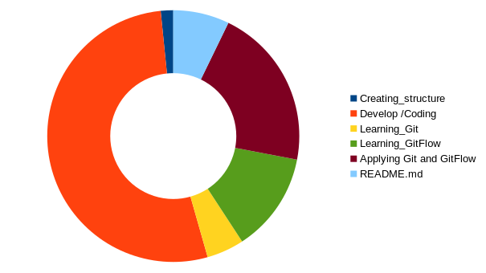
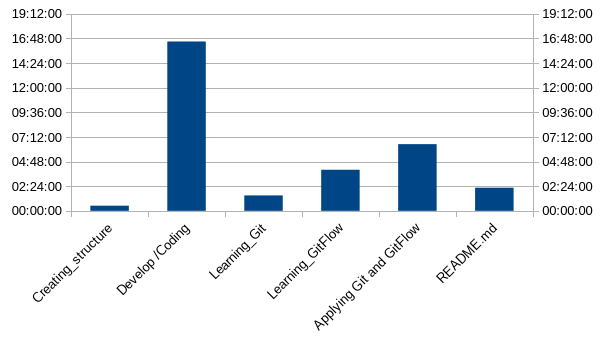
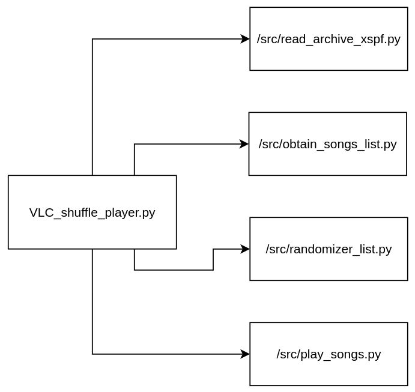

# VLC_shuffle_player

# Index

- [**About**](#about)
- [**Use**](#use)
  - [**Generate archive.xspf**](#generate-archivexspf)
  - [**Execution**](#execution)
- [**Time invested**](#time-invested)
- [**Application architecture**](#application-architecture)
- [**Requirements**](#requirements)

<br>

# About

The <span style="color: #00FF00">VLC_shuffle_player</span>, is a python program that, with the xspf file you provide, generates a random playback order of the songs that are referenced by the xspf file, and then opens a VLC window, and plays the random playlist that has been temporarily generated[^1].

<br>

> [!IMPORTANT]
> This program is documented on how to use it in a Linux environment.

[^1]: **Summary**: It's a python program, that takes as input files that are playable by vlc, when executing it opens the vlc program to play a list with a random order of the files playable by vlc that it took as input.

<br>

<br>

<br>


# Use

## Generate archive.xspf

1. Open the VLC, click on <span style="color: #6699FF">"Media"</span>.

1. <span style="color: #6699FF">"Open folder"</span>, next you select the folder of where you habe the songs.

1. <span style="color: #6699FF">"Play"</span>.

1. <span style="color: #6699FF">"Media"</span> + <span style="color: #6699FF">"Safe list reproduction"</span>, and you specify the name,(that in this case of use, you need to put the name of `list_songs.xspf`, in the directory `~/Escritorio/VLC_shuffle_player/`).

<br>

> [!WARNING]
> Once you generate the xspf file, you will not be able to change the directory of the songs.
>If you moved the songs to another directory, to get <span style="color: #00FF00">VLC_shuffle_player</span> working again, you must recreate the xspf file and move it back to the corresponding directory.

<br>

<br>

## Execution

1. Create folder where you will execute the <span style="color: #00FF00">VLC_shuffle_player</span> program :

```bash
$ mkdir ~/Escritorio/VLC_shuffle_player
```

<br>

2. Change to the folder program directory :

```bash
$ cd ~/Escritorio/VLC_shuffle_player
```
<br>

3. Download or clone this repository :

```bash
$ git clone "https://github.com/Penguin1866s/VLC_shuffle_player"
```
<br>

4. Execute <span style="color: #00FF00">VLC_shuffle_player</span> :

```bash
$ /bin/python ~/Escritorio/VLC_shuffle_player/VLC_shuffle_player.py
```

<br>

<br>

<br>

# Time invested





In total where ___31 hours___, and ___15 minutes___.

<br>

<br>

# Application architecture



<br>

<br>

# Requirements

- ## Programs :
  
  - VLC
  - Python3

  >Verify than the programs are instaled --> `$ [name_program] --version`
  
  >Install programs --> `$ sudo apt install [name_program]`


<br>

> author: ___Penguin1866s___
